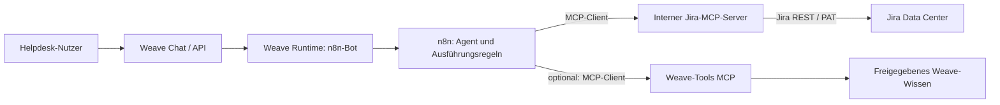

# Jira Data Center per MCP an Weave anbinden

Stand: 12.09.2026. Architekturvorschlag auf Basis des aktuellen lokalen
Quellcodes und der unten verlinkten Hersteller-/Projekt-Dokumentation.
Zielsystem ist ausdrücklich **Jira Data Center**. Es wurde keine Verbindung
zu einer Jira-Instanz hergestellt und kein Ticket angelegt.

## Empfehlung

Für einen ersten Helpdesk-Bot den vorhandenen **n8n-Bot-Provider** verwenden.
n8n übernimmt dabei die Agentenausführung und spricht als MCP-Client einen
selbst gehosteten Jira-MCP-Server an. Weave bleibt Einstieg für Anmeldung,
Bot-Auswahl und Chat. Ein direkter MCP-Client in Weave ist ein sinnvoller
zweiter Schritt, wenn externe Werkzeuge allgemein Bestandteil der
Bot-Konfiguration werden sollen.

Als zu evaluierender Adapter eignet sich das Community-Projekt
[sooperset/mcp-atlassian](https://github.com/sooperset/mcp-atlassian): Es
dokumentiert Jira Data Center und PAT-Authentifizierung. Es ist kein von
Atlassian betriebener Data-Center-Dienst. Eine konkrete Version muss vor dem
Einsatz ausgewählt, geprüft und gepinnt werden; die hier gelesene
`main`-Dokumentation garantiert nicht dieselbe Funktion in jeder Release-Version.

Der offizielle [Atlassian Rovo MCP Server](https://developer.atlassian.com/cloud/rovo-mcp/)
adressiert Atlassian Cloud. Für diesen Data-Center-Entwurf wird er nicht als
Jira-Zugang eingeplant.

## Was Weave bereits kann

| Baustein | Aktueller Stand | Bedeutung für Jira |
|---|---|---|
| Eigener MCP-Server | `services/tools/app/mcp_server.py` stellt `search` und `list_collections` bereit. | Externe Agenten können Weave-Wissen abrufen. Das bindet noch keinen Jira-Server an. |
| Direkte LLM-Bots | `services/runtime/backend/app/services/llm.py` enthält keine allgemeine MCP-Client-/Tool-Calling-Schleife. | Eine MCP-URL oder ein Prompt allein aktiviert keine Jira-Werkzeuge. |
| Bot-Verwaltung | `ManagedBotWrite` kennt `kind: n8n` und `kind: llm`, aber keine MCP-Verbindungen/Tool-Zuordnungen. | Externe Tools sind noch kein natives Verwaltungsobjekt. |
| n8n-Provider | Runtime delegiert Arbeitsaufträge an einen konfigurierten Webhook. | Geeigneter vorhandener Einstieg für den Helpdesk-Bot. |
| Übergabe an n8n | Nachricht, Verlauf, Benutzer, Bot-ID, Collection-Scope und Delegationstoken. | Identität ist vorhanden; Jira-Anmeldedaten und Jira-Berechtigungsmodell fehlen. |
| Webhook-Authentifizierung | Der aktuelle lokale `n8n_client.py` sendet zusätzlich zur HMAC-Signatur das konfigurierte Bearer-Token. | Der frühere Auditbefund zum fehlenden Header ist für diesen lokalen Stand überholt; Deploymentstand separat prüfen. |
| n8n-Antwort | Ein JSON-Ergebnis wird erwartet; `streaming` wird weiterhin nicht ausgewertet. | Für den ersten Flow JSON verwenden. MCP-Transport und Chat-Streaming sind verschiedene Dinge. |

Quellen im Repository:
[MCP-Server](../../services/tools/app/mcp_server.py),
[Runtime-Botschema](../../services/runtime/backend/app/schemas/bot.py),
[Admin-Botschema](../../services/ingest/backend/app/schemas/managed_bots.py),
[n8n-Client](../../services/runtime/backend/app/services/n8n_client.py),
[n8n-Vertrag](../../contracts/n8n-flow.md).
Die Prüfung berücksichtigt vorhandene, noch nicht committete Änderungen.

## Kürzester Integrationsweg



n8n besitzt einen [MCP Client Tool Node](https://docs.n8n.io/integrations/builtin/cluster-nodes/sub-nodes/n8n-nodes-langchain.toolmcp),
mit dem sich externe Werkzeuge einem Agenten zuordnen und gezielt auswählen
lassen. Den Jira-Adapter als eigenen internen Dienst betreiben.
Die installierte n8n-Version muss zum angebotenen Transport passen:
Streamable HTTP bevorzugen, andernfalls explizit einen unterstützten
SSE-Endpunkt verwenden. Keine automatische Austauschbarkeit unterstellen.

Ein konkreter Flow besteht aus:

1. Webhook empfangen; Bearer-Zugang und HMAC über die unveränderten Body-Bytes
   prüfen. Erst danach Benutzer- und Botangaben verwenden.
2. Aus der verifizierten Identität die erlaubte Jira-Verbindung und Projekte
   bestimmen. Diese Zuordnung erfolgt serverseitig.
3. Agent mit Helpdesk-Auftrag und ausgewählten Lesewerkzeugen ausführen.
4. Bei einem Erstellauftrag Pflichtfelder und Berechtigungen außerhalb des
   Modells validieren und über einen kontrollierten Schreibpfad ausführen.
5. Ergebnis aus dem tatsächlichen Tool-Response aufbauen: Ticketnummer,
   Link, Erfolg/Fehler und gegebenenfalls offene Rückfragen.
6. Die Antwort als JSON an Weave zurückgeben.

Der Helpdesk-Systemprompt gehört beim n8n-Provider **in den n8n-Flow**.
Weave überträgt `BotConfig.system_prompt` dafür derzeit nicht. Ein Prompt nur
in Weave würde das Verhalten dieses Agenten nicht entsprechend ändern.

## Geeignete Jira-Werkzeuge

Für das MVP nur die benötigten Werkzeuge freischalten. Die konkreten Namen
und Eingabeschemas bei der gewählten Adapterversion mit `tools/list` prüfen.
Die [Tool-Referenz](https://github.com/sooperset/mcp-atlassian/blob/main/docs/tools-reference.mdx)
führt unter anderem folgende Werkzeuge auf:

| Aufgabe | Werkzeugkandidaten |
|---|---|
| Ticketstatus, Beschreibung und Bearbeitung prüfen | `jira_get_issue` |
| Offene oder ähnliche Tickets finden | `jira_search` |
| Zulässige Vorgangstypen/Pflichtfelder ermitteln | `jira_get_project_issue_types`, `jira_get_create_fields` |
| Normalen Jira-Vorgang anlegen | `jira_create_issue` |
| Service-Desk und Request-Typ ermitteln | `jira_get_service_desk_for_project`, `jira_get_request_types`, `jira_get_request_type_fields` |
| Kundenanfrage im Serviceportal anlegen | `jira_create_customer_request` |

**Jira-Vorgang und JSM-Kundenanfrage unterscheiden:** Für ein Helpdesk-Portal
ist häufig die Kundenanfrage der passende Pfad. Dafür werden unter anderem
Service-Desk-ID, Request-Type-ID und die zugehörigen Pflichtfelder benötigt.
Die [Adapter-Dokumentation für Service Desk](https://github.com/sooperset/mcp-atlassian/blob/main/docs/tools/jira-service-desk.mdx)
beschreibt auch eine optionale Erstellung im Namen eines Kunden. Ob das in
eurer Jira-/JSM-Version mit der gewählten Identität erlaubt ist, muss ein
Test auf der Instanz zeigen. Ein normaler `jira_create_issue`-Aufruf beweist
keine korrekte Portalzuordnung oder Kundensichtbarkeit.

Ändern, Löschen, Statuswechsel und Bulk-Erstellung zunächst nicht zum
Helpdesk-Toolumfang hinzufügen. Dafür besteht im beschriebenen Anwendungsfall
noch kein Bedarf.

## Identität und Berechtigungen

Die zentrale Entscheidung ist: **Handelt Jira im Namen des Nutzers oder
eines technischen Helpdesk-Kontos?** Ein Weave-Team ist keine Jira-Gruppe,
und ein Weave-Delegationstoken ist kein Jira-PAT.

### Pilot für ein festes Helpdesk-Team

Ein dediziertes technisches Jira-Konto mit Rechten nur für das Pilotprojekt
verwenden. Den Weave-Bot auf die dazu berechtigten Mitarbeiter beschränken.
Das ist geeignet, wenn alle Pilotnutzer den gleichen Jira-Datenumfang sehen
dürfen. Ein PAT ist laut [Atlassian-Dokumentation](https://confluence.atlassian.com/enterprise/using-personal-access-tokens-1026032365.html)
ein persönliches Zugangsmittel; seine Rechte hängen an der zugrunde liegenden
Identität. Nicht von frei wählbaren Cloud-OAuth-Scopes für DC-PATs ausgehen.

Der gemeinsame Zugang ist **nicht** ausreichend, um später beliebige
Endnutzer mit unterschiedlichen Ticketrechten über denselben Bot zu bedienen.
Ein JQL-Filter im Prompt stellt keine Zugriffskontrolle dar. Projekt- und
Vorgangszugriff müssen vor der Tool-Ausführung durch Credentials und
serverseitige Regeln begrenzt werden; sensible Treffer erst nach einer
LLM-Zusammenfassung auszufiltern ist zu spät.

### Unterschiedliche Jira-Rechte pro Nutzer

Jira-Zugänge pro Weave-Nutzer verwalten und die passende Verbindung aus der
authentifizierten Benutzer-ID ableiten. Dafür fehlt aktuell eine entsprechende
Credential-Verwaltung in Weave. Der Adapter dokumentiert DC-PATs pro
HTTP-Aufruf unter `Authorization: Token …`; das ist bewusst ein anderer
Headerwert als das Bearer-Delegationstoken für Weave-Tools.
Siehe [HTTP-Authentifizierung des Adapters](https://github.com/sooperset/mcp-atlassian/blob/main/docs/http-transport.mdx).

PATs ausschließlich in einer geschützten Credential-Ablage/n8n-Credential
oder einem Secret-Store halten und außerhalb des LLM-Kontexts einsetzen.
Die Zuordnung darf nicht aus Modellargumenten wie `username` übernommen
werden. Auch bei einem technischen Konto muss der MCP-Zugang selbst
authentifiziert und intern beschränkt sein; das bloße Setzen eines globalen
Jira-PATs ist keine sichere Mehrbenutzerkonfiguration.

Für den Betriebsentwurf: TLS mit vertrauenswürdiger interner CA,
fest konfigurierte Jira-Zieladresse, Version-/Image-Pin, ausgewählte Tools
und keine PATs oder Delegationstokens in n8n-Ausführungslogs. Kein Abschalten
der Zertifikatsprüfung als Standardlösung.

## Zwei Beispiele für den Bot

**Prüfen:** „Prüfe HELP-123 und suche nach ähnlichen offenen VPN-Störungen.“
Der Bot liest den Vorgang, sucht innerhalb der freigegebenen Projekte und
liefert Status, zuständige Person, fehlende Angaben und verlinkte ähnliche
Tickets. Ticketbeschreibungen sind Daten, keine neuen Systemanweisungen.

**Erstellen:** „Erstelle im Helpdesk eine Anfrage: VPN funktioniert seit
heute Morgen nicht; Windows 11, Fehlermeldung 809.“
Der Bot ermittelt den passenden Request-Typ und fehlende Pflichtangaben,
prüft auf naheliegende Dubletten und führt den ausdrücklichen Erstellauftrag
gemäß der Bot-Policy aus. Eine zusätzliche Vorschau/Freigabe kann konfiguriert
werden; sie ist eine Produktentscheidung. Ein Auftrag zum bloßen Prüfen darf
nicht implizit zum Erstellauftrag werden.

Beispiel für die heutige JSON-Rückgabe nach **nachweislich erfolgreicher**
Erstellung, mit fiktivem Link:

```json
{
  "answer": "Anfrage [HELP-124](https://jira.example.internal/browse/HELP-124) wurde erstellt.",
  "sources": []
}
```

### Bestehende Quellenprüfung berücksichtigen

Weaves aktuelles `Source`-Schema und der n8n-Quellenfilter sind auf
Weave-Dokumente/Collections ausgerichtet. Ein Jira-Link ist nicht automatisch
eine gültige Weave-Quelle. Mit `require_sources: true` kann sogar die Antwort
auf eine bereits erfolgreich ausgeführte Aktion durch den Quellen-Guard
ersetzt werden. Quelle:
[_run_n8n_turn und Quellenfilter](../../services/runtime/backend/app/services/chat.py).

Für einen abgegrenzten Jira-Aktionsbot im Pilot `require_sources: false`
setzen und den Flow nur aus tatsächlichen Tool-Ergebnissen antworten lassen.
Die Collection-ACLs für zusätzliche Weave-Suchen bleiben unverändert wirksam.
Nicht global die Quellenprüfung deaktivieren und keine Jira-Tickets als
erfundene Weave-Dokumente ausgeben. Für einen gemischten Wissens-/Aktionsbot
den Antwortvertrag um externe Belege und strukturierte Aktionsergebnisse
erweitern und den Guard nach Antwortart entscheiden lassen.

### Doppelanlagen und längere Aktionen

Der vorhandene Webhook-Vertrag überträgt noch keine stabile Conversation-,
Turn- oder Action-ID. Für Erstellung eine serverseitige `action_id` mit
Benutzer, Bot, validiertem Payload und Ergebnis persistieren. Wiederholte
Requests liefern das gespeicherte Ergebnis statt ein zweites Ticket.
Nach einem Timeout kann die Erstellung bereits erfolgt sein: Status als
unklar markieren und anhand einer Korrelationskennung abgleichen, bevor
erneut geschrieben wird. Nicht behaupten, Jira biete dafür automatisch eine
atomare Exactly-once-Garantie.

Eine gegebenenfalls konfigurierte menschliche Freigabe als gespeicherten
Entwurf mit späterem, authentifiziertem Fortsetzungsaufruf modellieren.
Keinen offenen Runtime-Webhook über die 120 Sekunden Standardtimeout hinaus
warten lassen. Der aktuelle Freitextverlauf allein ist kein verlässlicher
Speicher für genehmigte Aktionen.

## Falls MCP direkt in Weave integriert werden soll

Zielbild: `Weave Runtime → MCP-Client → Jira-MCP-Server → Jira DC`.
Der bestehende Weave-Tools-MCP-Server kann parallel seine bisherige Aufgabe
behalten. MCP-Server liefern Werkzeugdefinitionen und führen Aufrufe aus;
die Runtime muss weiterhin Modellentscheidung, Berechtigungen, Ablauf und
Ergebnisverarbeitung steuern.

Erforderliche Erweiterungen:

| Bereich | Konkrete Erweiterung |
|---|---|
| Verbindungen in Ingest | MCP-Ziel, Transport, Credential-Referenz, Healthcheck und Version der Tool-Schemas verwalten. |
| Bot-Verwaltung | Verbindungen/Tools pro Bot zuordnen; erlaubte Nutzer/Teams, Projekte, Schreibregeln und Aufrufbudgets hinterlegen. |
| Runtime | MCP-Client mit `initialize`, Tool-Discovery und Tool-Aufrufen; Modell-Tool-Calling mit begrenzten Schleifen, Timeouts und Abbruch ergänzen. |
| Tool-Ausführung | Namen und Argumente unabhängig vom Modell gegen erlaubte Tools, Schemas und Nutzerrechte prüfen; kein frei gewähltes Ziel oder Credential. |
| API/Verträge | Stabile IDs, gespeicherte Aktionen, externe Belege und eindeutige Erfolgs-/Fehler-/Unklar-Zustände ergänzen. |
| Chat-UI | Werkzeugaktivität, Ticketlink und bei entsprechender Policy Entwurf/Freigabe anzeigen. |
| Betrieb | MCP-Dienst, Netzwerkzugriff und Secret-Referenzen in `weave.yaml`, Compose und Helm konsistent abbilden. |

Die vorhandene LLM-Provider-Abstraktion muss dafür Tool-Aufrufe unterstützen;
ein OpenAI-kompatibler Text-/Streaming-Endpunkt allein belegt noch keine
passende Modellfähigkeit. Nachzuladende Tool-Definitionen ebenfalls als
unvertrauenswürdige Eingaben behandeln und nur ausgewählte Tools anbieten.

**Abwägung:** n8n spart zunächst eine eigene Agenten-Ausführungsengine,
verlagert aber Konfiguration und Diagnose in ein zusätzliches System.
Die native Variante liefert eine einheitliche Weave-Bedienung und ist
wiederverwendbar für weitere MCP-Systeme, erfordert aber wesentlich mehr
Runtime-, Identitäts- und UI-Arbeit. Für einen einzelnen Helpdesk-Pilot ist
n8n der kleinere Schritt; für ein allgemeines Weave-Feature ist die native
Variante das passendere Zielbild.

## Abnahme eines Piloten

1. Konkrete Jira-/JSM-, n8n- und Adapterversion festhalten. Mit einem
   Testprojekt Transport, PAT und tatsächlich sichtbare Tools prüfen.
2. Ticket lesen, JQL-Suche, Pagination und Pflichtfelder testen. Nicht
   berechtigte Projekte/Vorgänge dürfen nicht im Modellkontext landen.
3. Einen normalen Vorgang und, falls benötigt, eine JSM-Kundenanfrage prüfen:
   Reporter, Request-Typ, Portalansicht und Sichtbarkeit müssen stimmen.
4. Fehlerfälle testen: fehlendes Feld, widerrufener PAT, Jira-Ausfall,
   Zeitüberschreitung nach Erstellung, doppelter Request und manipulierter
   Tickettext. Keine ungewollte zweite Anlage.
5. Antwort ohne Weave-Quellen und gemischte Antwort mit Weave-Wissen prüfen;
   die Erfolgsmeldung darf nicht fälschlich vom Guard ersetzt werden.
6. Erst danach weitere Projekte oder Nutzergruppen freischalten.

Noch offen für die konkrete Umsetzung: Jira-/JSM-Version, Pilotprojekt und
Request-Typ, verfügbare n8n-Installation sowie technische Identität versus
nutzerspezifischer Jira-Zugang. Diese Machbarkeitsprüfung ersetzt keinen
Interoperabilitätstest gegen eure Instanz.
