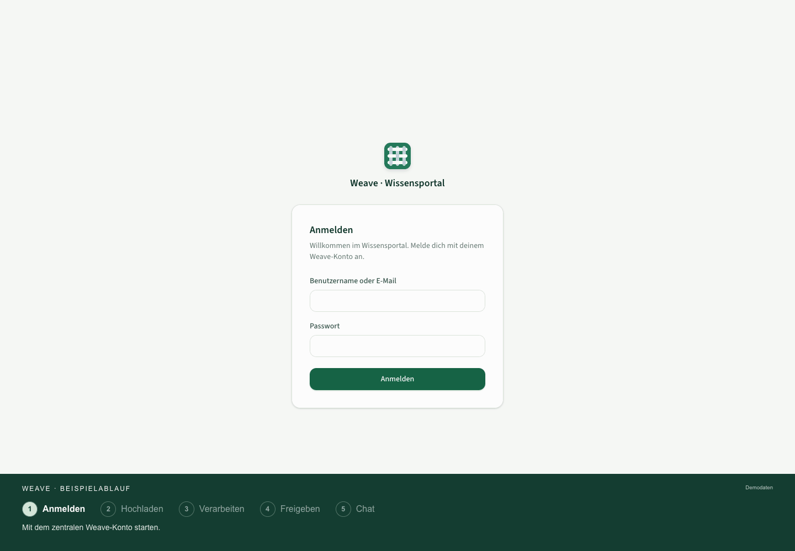
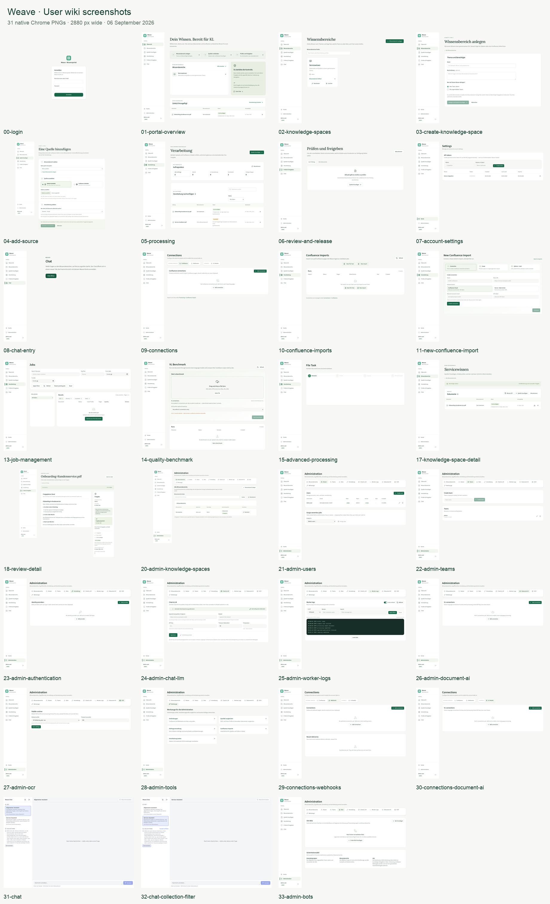

# Weave user wiki — screenshots and example workflow

Captured on **6 September 2026** in **Google Chrome using Playwright**.

[Open the visual gallery](index.html) · [Download the example GIF](weave-example-process.gif) · [Watch/download the MP4](weave-example-process.mp4)

## Example workflow

The 25.4-second animation shows five steps:

1. Sign in with a central Weave account.
2. Add `Onboarding-Kundenservice.pdf` to the `Servicewissen` knowledge space.
3. Follow document processing until the content is ready for review.
4. Review and approve the content, then see that indexing is complete.
5. Ask a question in chat and see an answer with a source reference.

**This is an illustrative demo using simulated UI states and fictional data.**
The chat answer is a clearly labelled mockup. The timing does not represent
real OCR, indexing or model latency. No live upload, approval or model request
was submitted to produce the animation.

The GIF and MP4 are 1440 × 1000 pixels. The video has playback controls in
the gallery; all 12 original animation frames are available in
[process-frames/](process-frames/).

## Screenshot quality and provenance

- 31 native PNGs, each **2880 pixels wide**, captured at a 1440 × 1000 CSS-pixel
  viewport and **2× device pixel density**. Long pages retain their full height.
- Current HTML and CSS were captured from the running local application.
  Personal data, document contents, token rows, endpoints and worker logs were
  replaced in an inert documentation copy **before** Chrome rendered it.
- The UI is therefore a current browser render with neutral example data.
  It is not an unmodified capture of production data or a live process recording.
- No upscaling, JPEG intermediates, pixel-position redaction boxes or stitched
  screenshots. Fonts finish loading before capture. The original CSS, icons,
  layout and controls are preserved in the still images.
- Mixed German/English labels and currently unavailable controls reflect the
  current application. They have not been silently redesigned for the wiki.

The contact sheet is only an overview. Use the individual PNGs below for
documentation, zooming and export.

## Sign-in and knowledge workflow

| Screenshot | Function |
|---|---|
| [00-login.png](00-login.png) | Local sign-in |
| [01-portal-overview.png](01-portal-overview.png) | Portal overview and guided workflow |
| [02-knowledge-spaces.png](02-knowledge-spaces.png) | Find, open, rename and delete knowledge spaces |
| [03-create-knowledge-space.png](03-create-knowledge-space.png) | Create a knowledge space and select authorized teams |
| [04-add-source.png](04-add-source.png) | Upload documents or individual emails, connect Confluence, and choose processing profiles |
| [05-processing.png](05-processing.png) | Track queued, running, completed and failed processing |
| [06-review-and-release.png](06-review-and-release.png) | Find documents ready for review |
| [17-knowledge-space-detail.png](17-knowledge-space-detail.png) | Documents, indexing status, Markdown and ZIP downloads |
| [18-review-detail.png](18-review-detail.png) | Review content, approve a version and track availability for AI |

## Personal settings and chat

| Screenshot | Function |
|---|---|
| [07-account-settings.png](07-account-settings.png) | Personal API-token management; example token row |
| [08-chat-entry.png](08-chat-entry.png) | Portal entry point to chat |
| [31-chat.png](31-chat.png) | Choose a bot and start a conversation |
| [32-chat-collection-filter.png](32-chat-collection-filter.png) | Restrict a conversation to selected authorized knowledge spaces |

## Connections and specialist tools

| Screenshot | Function |
|---|---|
| [09-connections.png](09-connections.png) | Confluence connections |
| [10-confluence-imports.png](10-confluence-imports.png) | Import history |
| [11-new-confluence-import.png](11-new-confluence-import.png) | New Confluence import and connection form |
| [13-job-management.png](13-job-management.png) | Advanced processing-job management |
| [14-quality-benchmark.png](14-quality-benchmark.png) | Compare document-processing profiles |
| [15-advanced-processing.png](15-advanced-processing.png) | Advanced processing entry point |
| [29-connections-webhooks.png](29-connections-webhooks.png) | Outgoing webhooks |
| [30-connections-document-ai.png](30-connections-document-ai.png) | Vision-language connections |

## Administration

| Screenshot | Function |
|---|---|
| [20-admin-knowledge-spaces.png](20-admin-knowledge-spaces.png) | Manage all knowledge spaces, owners and authorized teams |
| [21-admin-users.png](21-admin-users.png) | Local accounts, roles and team membership |
| [22-admin-teams.png](22-admin-teams.png) | Team management |
| [23-admin-authentication.png](23-admin-authentication.png) | OIDC / SSO providers |
| [24-admin-chat-llm.png](24-admin-chat-llm.png) | OpenAI-compatible chat provider configuration; example endpoint |
| [25-admin-worker-logs.png](25-admin-worker-logs.png) | Worker-log viewer; synthetic log lines |
| [26-admin-document-ai.png](26-admin-document-ai.png) | Document AI connections |
| [27-admin-ocr.png](27-admin-ocr.png) | OCR settings |
| [28-admin-tools.png](28-admin-tools.png) | Administrative tools |
| [33-admin-bots.png](33-admin-bots.png) | Managed bots and team access; reflects the currently available controls |

## Maintenance notes

Keep filenames stable so existing wiki links continue working. Retake from the
updated UI after feature changes and replace the matching PNG. Capture directly
with Chrome / Playwright using `deviceScaleFactor: 2`, `type: 'png'` and
`fullPage: true`; wait for `document.fonts.ready` before capture.

Sanitize documentation data in the DOM copy before rendering, not with fixed
pixel overlays after capture. Keep the original PNGs and their native geometry.
Do not represent demo states or generated chat answers as actual service results.

[capture-manifest.json](capture-manifest.json) records the viewport, image
filenames, font readiness, image loading and layout checks. The private raw
DOM captures and live application state are not included in this directory.

For application usage, see [the knowledge portal guide](../../wissensportal.md).
