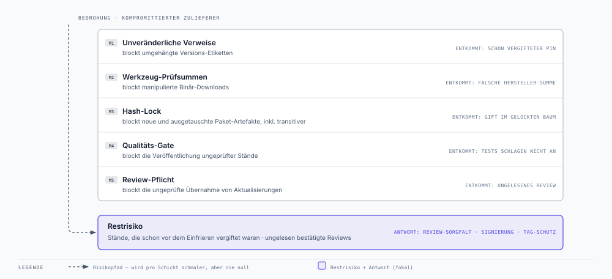
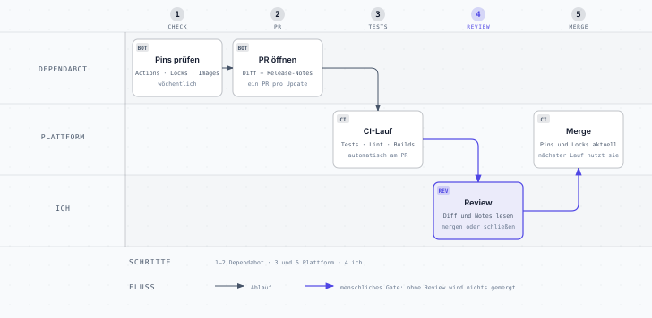

# Supply-Chain-Härtung: mein Blueprint gegen Lieferketten-Angriffe

*Der Supply-Chain-Vorfall vom März 2026 hat mich veranlasst, die Build- und
Release-Ketten aller meiner Anwendungen zu härten, von Weave Ingest bis zu den
internen Werkzeugen. Dieser Beitrag ist der Blueprint, nach dem ich dabei
vorgegangen bin. Er ist produktneutral gehalten und lässt sich auf jede
Anwendung mit automatisierter Pipeline übertragen.*

## 1. Anlass

Im März 2026 wurden über einen einzigen kompromittierten Open-Source-Baustein
mehr als 2.500 Unternehmen und über 400.000 CI/CD-Pipelines angegriffen. Das
Muster: Ein Werkzeug, das Build-Pipelines ungeprüft in der jeweils „neuesten"
Version beziehen, wurde durch eine bösartige Version ersetzt. Die Schadsoftware
lief dadurch automatisch in den Release-Prozessen der Opfer und stahl dort
Zugangsdaten und Signaturschlüssel. In deren eigenem Code hatte sich keine
einzige Zeile geändert.

Möglich war das, weil Pipelines ihre Drittkomponenten über *veränderliche*
Verweise beziehen („nimm Version 4", „nimm das Neueste") statt über
*unveränderliche*:


Der entscheidende Moment ist **Schritt 3**, der ungeprüfte Bezug. Alles davor
passiert außerhalb meines Einflussbereichs. Alles danach ist nur noch
Konsequenz. Genau an diesem Übergang setzt der Blueprint an.

## 2. Schutzziel

**Kein Bestandteil meines Build- und Release-Prozesses darf sich ändern
können, ohne dass die Änderung bei mir als sichtbare, prüfpflichtige
Codeänderung erscheint.** Wer einen meiner Zulieferer kompromittiert, darf
damit nicht automatisch in meine Auslieferung gelangen.

## 3. Die fünf Maßnahmen im Detail

### M1: Unveränderliche Verweise für Pipeline-Bausteine

**Das Problem.** CI-Pipelines setzen sich aus Fremdbausteinen zusammen:
Checkout, Build-Werkzeuge, Publish-Schritte. Referenziert wird üblicherweise
über Versions-Etiketten wie `@v4`. So ein Etikett ist technisch nur ein
verschiebbarer Zeiger. Der Anbieter kann es jederzeit auf einen anderen Stand
umhängen, ein Angreifer mit dessen Zugangsdaten ebenso, und jede Pipeline
führt beim nächsten Lauf ungefragt den neuen Code aus. Genau dieses Umhängen
bereits vergebener Etiketten war der Kern des Vorfalls. Reale Fälle bei
verbreiteten CI-Bausteinen gab es schon vorher.

**Die Maßnahme.** Jeder Fremdbaustein wird auf den kryptografischen
Fingerabdruck (Commit-Hash) eines exakten, geprüften Stands festgeschrieben.
Ein Fingerabdruck lässt sich nicht umhängen. Er ist der Inhalt. Die
menschenlesbare Version bleibt als Kommentar daneben stehen. Wichtig ist
Vollständigkeit: Die Regel gilt für alle Pipelines, gerade für die
unscheinbaren. Doku-Builds und Hilfs-Workflows laufen mit denselben Rechten
wie die prominenten.

**Wirkung und Aufwand.** Ein kompromittierter Anbieter erreicht meine
Pipeline nicht mehr, ohne dass bei mir eine sichtbare Änderung ansteht. Die
Umstellung kostet pro Anwendung weniger als eine Stunde. Die laufende Pflege
übernimmt die Automatik aus M5.

### M2: Echtheitsprüfung für heruntergeladene Werkzeuge

**Das Problem.** Pipelines laden zur Laufzeit Binärwerkzeuge herunter und
führen sie direkt aus. HTTPS schützt dabei nur den Weg, die Quelle bleibt
ungeprüft. Wird der Download-Server oder das Release-Artefakt selbst
kompromittiert, liefert die verschlüsselte Verbindung brav das manipulierte
Werkzeug aus. Mitten in eine Pipeline, die anschließend mit
Veröffentlichungs-Rechten weiterarbeitet.

**Die Maßnahme.** Für jedes zur Laufzeit geladene Werkzeug hinterlege ich die
vom Hersteller separat veröffentlichte SHA-256-Prüfsumme im Pipeline-Code.
Vor der Ausführung wird der Download dagegen verifiziert. Bei Abweichung
bricht der Build hart ab.

**Wirkung und Aufwand.** Ein manipuliertes Artefakt fällt auf, bevor es
ausgeführt wird. Der Aufwand liegt bei wenigen Minuten pro Werkzeug, einmalig.

### M3: Vollständiges Hash-Locking der Produkt-Abhängigkeiten

**Das Problem.** Das ausgelieferte Produkt besteht zum Großteil aus fremden
Softwarepaketen. Dazu zählen die direkt benannten und ein Baum aus Dutzenden
bis Hunderten transitiv mitgezogenen Paketen. Jede ungepinnte Stelle in
diesem Baum bedeutet: Der nächste Build kann anderen Code enthalten als der
letzte, ohne dass irgendjemand etwas geändert hat. Der Vorfall hat außerdem
gezeigt, dass Paket-Ökosysteme Code schon bei der Installation ausführen
können. Ein vergiftetes Paket muss nie importiert werden, um zu wirken.

**Die Maßnahme.** Eine Lock-Datei schreibt den kompletten Abhängigkeitsbaum
fest, jedes Paket mit exakter Version und den Prüfsummen seiner Artefakte.
Installiert wird im strikten Modus: Jedes Artefakt, dessen Prüfsumme fehlt
oder abweicht, bricht den Build ab. Das gilt auch bei gleichbleibender
Versionsnummer und schließt damit die zweite, subtilere Angriffsklasse, den
Austausch eines bereits veröffentlichten Artefakts.

Zwei Details entscheiden über die Belastbarkeit. Erstens erzeuge und
validiere ich die Lock-Datei in exakt der Umgebung, die auch die echten
Releases baut: gleiches Betriebssystem, gleiche Architektur, gleicher
Interpreter. Abhängigkeitsauflösung ist plattformabhängig, und eine auf dem
Laptop erzeugte Festschreibung kann im Release-Build anders ausfallen.
Zweitens deckt die strikte Auflösung reale Widersprüche auf. In meinem Fall
erklärte die neueste Version eines zentralen Pakets Anforderungen, die sich
mit denen seiner eigenen Unterabhängigkeit ausschlossen. Der bisherige
ungepinnte Build hatte diesen Konflikt jahrelang still „irgendwie" aufgelöst.
Das Lock macht solche Zustände sichtbar und entscheidbar.

**Wirkung und Aufwand.** Builds werden reproduzierbar. Weder eine bösartige
neue Version noch ein ausgetauschtes altes Artefakt gelangt unbemerkt ins
Produkt. Einmalig kostet das einige Stunden inklusive Validierung im
Build-Kontext. Danach pflegt M5 die Datei weiter.

### M4: Qualitäts-Gate vor jeder Veröffentlichung

**Das Problem.** In vielen Pipelines genügt ein einziges Signal für die
Veröffentlichung: das Setzen einer Release-Markierung. Der Vorfall hat
gezeigt, dass genau dieses Signal fälschbar ist. Und auch ohne Angreifer
gilt: Ein ungetestetes Release ist ein Betriebsrisiko.

**Die Maßnahme.** Die Veröffentlichungs-Pipeline führt vor dem Publizieren
den kompletten automatisierten Prüflauf aus, auf exakt dem Stand, der
veröffentlicht werden soll. Erst ein vollständig grüner Lauf schaltet die
Veröffentlichungs-Schritte frei.

**Wirkung und Aufwand.** Ein manipulierter oder schlicht defekter Stand lässt
sich nicht mehr still veröffentlichen. Das kostet ein paar Minuten
zusätzliche Laufzeit pro Release. Genau für diese Prüfung ist das
Release-Verfahren da.

### M5: Aktualisierung mit Review-Pflicht

**Das Problem.** Festgeschriebene Stände veralten. Pinning ohne
Update-Prozess tauscht das Lieferketten-Risiko gegen das Risiko veralteter
Komponenten. Und wer Updates automatisch übernimmt, reißt die gerade
geschlossene Tür wieder auf. Der Vorfall verbreitete sich exakt über die
ungeprüfte Übernahme des „Neuesten".

**Die Maßnahme.** Ein automatischer Dienst prüft wöchentlich alle
festgeschriebenen Bezüge (Pipeline-Bausteine, Produkt-Abhängigkeiten,
Basis-Images) und erstellt für jede verfügbare Aktualisierung einen
prüfpflichtigen Änderungsantrag: sichtbarer Diff, Verweis auf die
Release-Notes, automatischer Testlauf. Übernommen wird ausschließlich nach
meinem Review. Automatisches Zusammenführen ist abgeschaltet. Der Dienst
pflegt dabei auch die Fingerabdrücke aus M1 und die Lock-Dateien aus M3 und
hält die Härtung damit dauerhaft betreibbar.

**Wirkung und Aufwand.** Sicherheit und Aktualität schließen sich nicht mehr
aus. Laufend bleibt das wöchentliche Review der Vorschläge. Minuten, keine
Stunden.

### Durchsetzungsorte im Überblick

Jede Maßnahme hat einen klaren Durchsetzungsort, eine durchsetzende Instanz
und einen Zeitpunkt. Das unterscheidet einen Kontrollkatalog von einer
Absichtserklärung:


## 4. Vorher / Nachher

| Bezugspunkt | Vorher | Nachher |
|---|---|---|
| CI-Bausteine (Actions) | Versions-Etikett, nachträglich verschiebbar | Commit-Fingerabdruck, unveränderlich (M1) |
| Laufzeit-Werkzeuge | Download und Ausführung ohne Prüfung | Prüfsummen-Abgleich vor Ausführung (M2) |
| Produkt-Abhängigkeiten | teils ungepinnt, „neueste Version gewinnt" | Version + Prüfsumme, inkl. transitiver Pakete (M3) |
| Release-Auslösung | Release-Signal genügt | Release-Signal **und** grüner Prüflauf (M4) |
| Aktualisierungen | implizit beim nächsten Build | explizite, review-pflichtige Änderungsanträge (M5) |
| Änderung beim Zulieferer | fließt unsichtbar ein | erscheint als sichtbare Codeänderung bei mir |

## 5. Qualitätssicherung der Umsetzung

Jeden festgeschriebenen Fingerabdruck habe ich unabhängig gegen die
Originalquelle gegengeprüft, jede Prüfsumme gegen die offizielle
Veröffentlichung des Herstellers. Die Installierbarkeit der gelockten
Abhängigkeiten habe ich im realen Build-Kontext getestet, bevor die
Änderungen übernommen wurden. Der erste echte Release nach der Umstellung
lief vollständig durch die gehärtete Kette, inklusive Qualitäts-Gate und
hash-verifizierter Installation aller festgeschriebenen Pakete.

## 6. Grenzen und Restrisiken

Ehrlichkeit gehört zu einem belastbaren Sicherheitskonzept. Was dieser
Blueprint nicht leistet:



- **Kompromittierung vor dem Festschreiben.** Wer einen Stand pinnt, der
  bereits bösartig war, pinnt den Schaden mit. Die Maßnahmen frieren
  Vertrauen ein. Erzeugen können sie es nicht. Entstehen muss es im Review
  neuer Stände (M5).
- **Qualität des menschlichen Reviews.** M5 ersetzt die automatische
  Übernahme durch eine menschliche Entscheidung. Wenn ich jeden Vorschlag
  ungelesen bestätige, ist der Gewinn dahin.
- **Kompromittierung der eigenen Zugänge.** Wer Schreibrechte auf Repository
  oder Registry erbeutet, umgeht die Lieferketten-Kontrollen. Dagegen helfen
  andere Schichten: kurzlebige Tokens mit minimalen Rechten, Tag- und
  Branch-Schutz, Zwei-Faktor-Authentisierung.
- **Verhalten zur Laufzeit.** Die Maßnahmen sichern den Weg in das Artefakt.
  Was ein legitim eingebautes Paket zur Laufzeit tut, liegt außerhalb ihres
  Rahmens.

## 7. Ausbaustufen (optional, empfohlen)

- Release-Markierungen und Hauptentwicklungslinie gegen nachträgliches
  Überschreiben schützen (eine Plattform-Einstellung, kein Code).
- Basis-Container-Images per Fingerabdruck festschreiben.
- „latest"-Standardwerte aus Auslieferungskonfigurationen entfernen.
- Die eigenen veröffentlichten Artefakte kryptografisch signieren.

## 8. Anwendung auf die nächste Anwendung: die Checkliste

1. **Inventur:** Alle Stellen erfassen, an denen die Pipeline Fremdes bezieht
   (CI-Bausteine, Werkzeug-Downloads, Paketinstallationen, Basis-Images).
2. **M1:** CI-Bausteine auf Commit-Fingerabdrücke umstellen. Die
   Versionsnummer bleibt als Kommentar lesbar.
3. **M2:** Für jeden Werkzeug-Download die offizielle Prüfsumme hinterlegen.
4. **M3:** Ungepinnte Installationen auf exakte Versionen heben und in eine
   hash-gelockte Abhängigkeitsdatei überführen. Im echten Build-Kontext
   validieren.
5. **M4:** Publish-Pipeline vom vollständigen Prüflauf abhängig machen.
6. **M5:** Automatisierte Update-Vorschläge aktivieren, ohne Auto-Merge. Sie
   pflegen auch die Fingerabdrücke aus M1 und die Locks aus M3 weiter.
7. **Verifikation:** Fingerabdrücke und Prüfsummen unabhängig gegen die
   Originalquellen abgleichen, bevor die Änderungen übernommen werden.

Der Erstaufwand liegt pro Anwendung im Bereich weniger Stunden. Laufend
bleibt das wöchentliche Review der Update-Vorschläge.

## 9. So sieht das im CI konkret aus

Fünf Ausschnitte aus den echten Pipelines, jeweils aufs Wesentliche gekürzt.

#### M1: Actions pinnen

```yaml
# vorher: verschiebbares Etikett
- uses: actions/checkout@v5

# nachher: Commit-Fingerabdruck, die Version bleibt als Kommentar lesbar
- uses: actions/checkout@fbc6f3992d24b796d5a048ff273f7fcc4a7b6c09 # v5.1.0
```

#### M2: Werkzeug-Downloads prüfen

```yaml
- name: Install Helm
  run: |
    curl -fsSL https://get.helm.sh/helm-v3.16.2-linux-amd64.tar.gz -o helm.tgz
    echo "9318379b847e333460d33d291d4c088156299a26cd93d570a7f5d0c36e50b5bb  helm.tgz" | sha256sum -c -
    tar -xzf helm.tgz
    sudo mv linux-amd64/helm /usr/local/bin/helm
```

Stimmt die Prüfsumme nicht, bricht der Build ab. Ein Werkzeug-Update ist ab
jetzt ein Zwei-Zeilen-Diff: neue Version, neue Prüfsumme.

#### M3: Hash-Lock installieren

```dockerfile
COPY requirements-worker.txt /app/requirements-worker.txt
RUN pip install --no-cache-dir --require-hashes -r /app/requirements-worker.txt
```

Die Lock-Datei entsteht per `pip-compile --generate-hashes` im selben
Container-Image, das auch die Releases baut. Jedes Artefakt ohne passenden
Hash stoppt die Installation.

#### M4: Release-Gate

```yaml
jobs:
  ci:
    uses: ./.github/workflows/pr-ci.yml
  publish:
    needs: ci
```

Der Release-Tag allein veröffentlicht nichts mehr. Erst ein grüner Prüflauf
schaltet den Publish-Job frei.

#### M5: Dependabot

```yaml
version: 2
updates:
  - package-ecosystem: "github-actions"
    directory: "/"
    schedule:
      interval: "weekly"
```

Gleiche Blöcke gibt es für `npm`, `pip` und `docker`. Auto-Merge bleibt aus.

## 10. Wer entscheidet was

Dependabot ist fleißig, aber er entscheidet nichts. Jeder Vorschlag nimmt
denselben Weg:



| Meldung | Kommt von | Was zu tun ist | Wann |
|---|---|---|---|
| Patch- oder Minor-Update (npm, pip, Actions) | Dependabot-PR | Diff und Release-Notes lesen, bei grüner CI mergen | im wöchentlichen Sammel-Review |
| Major-Update oder neues Basis-Image | Dependabot-PR | Breaking Changes prüfen und lokal testen, erst dann mergen | sobald Zeit für einen echten Test ist |
| Prüflauf auf main rot | CI-Benachrichtigung | sofort ansehen, fixen oder zurückrollen | am selben Tag |
| Release-Tag gesetzt | mir selbst | nichts. Das Gate entscheidet: Nur ein grüner Lauf publiziert | automatisch |
| Neue Abhängigkeit im Code | Entwicklung | Pin und Hash gehören in denselben Commit wie die Abhängigkeit | vor dem Merge |

Und bei einer Ablehnung? Dann wird der PR mit einem Satz Begründung
geschlossen. Dependabot meldet sich erst wieder, wenn die nächste Version
erscheint.

---

*Quelle zum Vorfall: CloudSEK, „AI Supply Chain Breach — 2,500 Companies,
434,000 CI/CD Pipelines" (März 2026).*

