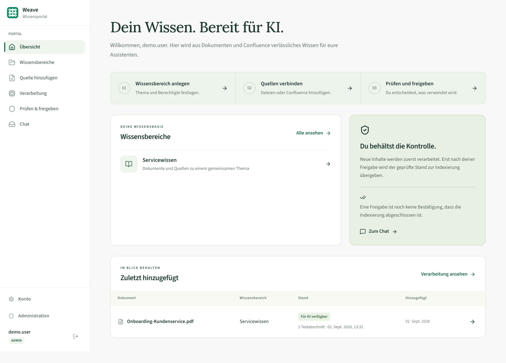
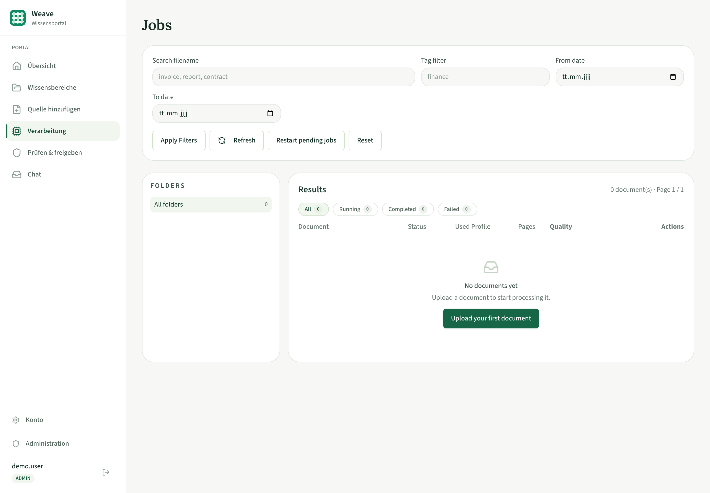
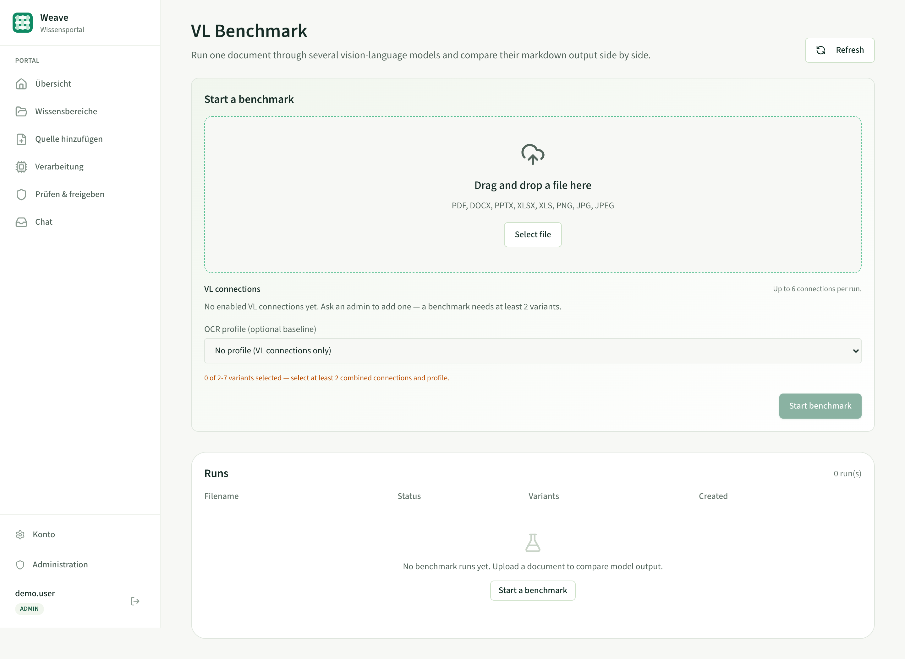
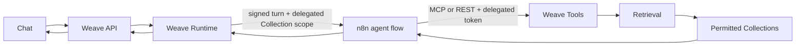

#  Weave Ingest

[](../../LICENSE)

[](backend/Dockerfile)
[](backend/requirements.in)
[](backend/worker.Dockerfile)
[](frontend/package.json)
[](docker-compose.yml)
[](docker-compose.yml)
[](docker-compose.yml)
[](charts/weave-ingest)


Weave Ingest is a document processing platform powered by PaddleOCR that converts PDFs, Office files, Mails and images into structured Markdown for RAG and AI pipelines.

It is built for teams that need reliable ingestion quality, searchable outputs, and simple deployment options from standalone NAS Docker to Kubernetes.

Weave Ingest is the document compiler of the Weave system and is based on PaddleDoc. Its
frontmatter and event contracts — the shape every other Weave component relies on — live
in [`contracts/`](../../contracts/); the architectural decisions behind this transformation are
recorded in [`docs/adr/`](../../docs/adr/).



## Why Weave Ingest

Managing OCR and document normalization at scale gets messy fast. Weave Ingest gives you one workflow for ingestion, extraction, quality scoring, versioning, and retrieval-ready output.

- AI-first Markdown output with rich YAML frontmatter (source, hash, version, uploader, team, engine)
- **Document versioning built in** — re-uploading a changed file becomes version N+1 with full history; byte-identical re-uploads are detected and skipped
- Multiple OCR and vision profiles (fast OCR, layout-aware, VL, OpenAI-compatible) — **VL connections work as normal processing profiles**, not just benchmark participants: any admin-configured vision-language endpoint shows up as `VL: <name>` in the File Task wizard and every re-run picker
- **VL Benchmark** — run one document against up to 6 vision-language models plus an OCR baseline and compare the results side by side
- **Personal API tokens** — programmatic access via `Authorization: Bearer`, no cookie handling
- **Mail ingestion** — POST a raw email and Weave Ingest parses it, renders the body
  to Markdown, and OCRs every attachment as its own job; idempotent by content hash
- **Confluence import with real hierarchy** — imported pages carry breadcrumb frontmatter (`space`, `confluence_path`, `parent_title`, `depth`), navigation pages are flagged, parents get `children_titles`, and an opt-in toggle turns the breadcrumb into filterable job tags; runs can be edited and re-run from their own history
- Folder and tag organization, search, quality grades, JSON export per job
- Queue-based processing with backend + worker separation; worker logs live in the admin console
- User accounts with team visibility, local login and OIDC SSO (Keycloak, Microsoft Entra ID), with Entra-friendly claim resolution and sign-in events visible in the admin Logs tab

## Get Started

Choose your deployment mode:

| Mode | Best for | Command |
|---|---|---|
| Standalone Docker | Everyone — Windows, macOS, Linux, NAS | `./scripts/init-env.sh && docker compose up -d` |
| Docker (Dev/Single Host) | Contributors building the images from source | `./scripts/init-env.sh && docker compose -f docker-compose.dev.yml up --build` |
| Docker + NVIDIA GPU | Windows Docker Desktop with GPU-enabled worker profile | `wsl bash scripts/init-env.sh; docker compose -f docker-compose.yml -f docker-compose.gpu.yml up -d` |
| Kubernetes (Helm) | k3s/k8s clusters and scale-out deployments | `helm upgrade --install weave-ingest ./charts/weave-ingest -n weave-ingest --create-namespace --set auth.secretKey.value=$(openssl rand -hex 32)` |

### Standard Deployment (No Kubernetes)

One file, every platform: `docker-compose.yml` pulls the prebuilt GHCR images and
keeps all data in Docker-managed volumes, so the same `docker compose up -d` works
on Windows, macOS, Linux and a NAS — no directory to create, no ownership to fix.
To place the data on a specific share or disk instead, see
[Storing data on a NAS share](#storing-data-on-a-nas-share) below.

```bash
# Generates SECRET_KEY, POSTGRES_PASSWORD and REDIS_PASSWORD into .env.
# The compose files have no fallback values for these on purpose — a default
# that ships in the repository is a published secret, and SECRET_KEY is the
# key every stored OIDC client secret, Confluence credential and VL API key
# is encrypted under. Compose refuses to start until they are set.
./scripts/init-env.sh

docker compose up -d
```

Further environment values go into the same `.env` next to the compose file — see `.env.example`:

```bash
POSTGRES_USER=weave_ingest
POSTGRES_PASSWORD=change-this
POSTGRES_DB=weave_ingest
WEAVE_INGEST_TAG=latest
WEAVE_INGEST_PUBLIC_API_URL=http://NAS_IP:8000    # optional — see below

# Since v1.1.0 (authentication):
SECRET_KEY=generate-with-openssl-rand-hex-32   # signs sessions, encrypts stored secrets — set once, never change
REDIS_PASSWORD=change-this-too
PUBLIC_API_URL=http://NAS_IP:8000              # backend URL used for OIDC redirect URIs
CORS_ORIGINS=["http://NAS_IP:3000"]            # your frontend origin(s); no wildcard — cookies are credentialed
```

**The two API URLs are different variables and easy to mix up:**

| Variable | Read by | Must be reachable by |
|---|---|---|
| `PUBLIC_API_URL` | backend, server-side | your OIDC provider (builds the redirect URI) |
| `WEAVE_INGEST_PUBLIC_API_URL` | frontend, handed to the browser | the browser (and it goes into the CSP `connect-src`) |

`WEAVE_INGEST_PUBLIC_API_URL` is optional. Left unset, the frontend derives
`<page protocol>//<page hostname>:8000`, which is correct whenever backend and
frontend share a host — the usual case. Set it only when a reverse proxy serves
the API under a different name, and then give it the **same host as the page in
the address bar**: mixing `localhost` and an IP makes the browser treat the
session cookie as cross-site, `SameSite=lax` drops it, and login succeeds with
200 while every following request returns 401. Every origin you open the UI
under also has to be listed in `CORS_ORIGINS`.

Endpoints:

- Frontend: `http://NAS_IP:3000`
- Backend: `http://NAS_IP:8000`

First run: open `http://NAS_IP:3000/setup` and create the initial admin account. Everything else requires a login from then on. Database migrations run automatically on backend startup.

### Storing data on a NAS share

The named volumes of the standard file live wherever Docker keeps its data and are
the right default everywhere. When the data has to sit on a particular share —
because that is what your backup covers, or because the volume needs to be on a
larger disk — overlay `docker-compose.nas.example.yml`, which redirects the four
volumes to host paths and changes nothing else:

```bash
# copy it, point it at your own share, then:
docker compose -f docker-compose.yml -f docker-compose.nas.example.yml up -d
```

The directories must exist and belong to the container UIDs (999 for Postgres and
Redis, 1000 for backend and worker) — the file spells the commands out. Linux hosts
and NAS boxes only: on Docker Desktop a bind mount cannot be `chmod`ed to `0700`,
which Postgres requires for `PGDATA`, so `initdb` fails there. Windows and macOS
should stay on the named volumes.

### Docker (Local Build)

For contributors changing backend, worker or frontend code — builds every image from
this checkout and publishes Postgres and Redis on the host. It runs under its own
compose project name, so it never touches the volumes of a standard install on the
same machine.

```bash
docker compose -f docker-compose.dev.yml up --build
```

Endpoints:

- Frontend: `http://localhost:3000`
- Backend: `http://localhost:8000`

### Kubernetes (Helm)

Quick install from local chart:

```bash
helm upgrade --install weave-ingest ./charts/weave-ingest \
  --namespace weave-ingest --create-namespace \
  --set auth.secretKey.value=$(openssl rand -hex 32)
```

Install from GHCR OCI chart:

```bash
helm install weave-ingest oci://ghcr.io/bl0rb/charts/weave-ingest --version 0.1.0 \
  --namespace weave-ingest --create-namespace \
  --set auth.secretKey.value=$(openssl rand -hex 32)
```

Since chart 1.1.0 a `SECRET_KEY` is required — the chart refuses to render without `auth.secretKey.value` or `auth.secretKey.existingSecret` (prefer the latter in real deployments, e.g. provisioned via External Secrets Operator). More chart options and examples are in [charts/weave-ingest/README.md](charts/weave-ingest/README.md).

## Core Features

- Upload via drag and drop or file picker (PDF, DOCX, PPTX, XLSX, XLS, PNG, JPG, JPEG, EML)
- **Content-hash document versioning**: same-named uploads within a team become version chains with full history; identical content is deduplicated
- Job lifecycle `PENDING -> RUNNING -> FINISHED / FAILED` with adaptive live updates, owner attribution on every row
- Folder tree navigation, tags, search and filtering, date ranges, status chips and a job-type filter (single file / collection / Confluence import / mail)
- A/B/C document quality gate per job
- Versioned markdown editing on the job detail page, reachable straight from a jobs-table row action
- **JSON export per job** — metadata, uploader, processing details, and markdown in one file
- **VL Benchmark** with per-variant metrics and side-by-side markdown comparison; the same VL connections double as selectable processing profiles for regular uploads
- **Personal API tokens** for programmatic access (created on the Settings page, shown once, stored hashed)
- **Individual email uploads** — upload `.eml` files in the knowledge portal; body and supported attachments form one document, reviewed and released like other files. The separate Mail API has been removed.
- **Confluence import** with hierarchy-aware frontmatter, an opt-in hierarchy-as-tags toggle, and an "Edit & run again" action that reopens a past run's settings
- Jobs can be re-run with a different profile from either the jobs table or the job detail page
- **Worker logs in the admin console** — level/worker/text filters, auto-refresh, tracebacks — alongside a Logs tab entry for every sign-in (OIDC and local)
- Password-gated view/download/edit/delete per job
- OpenAI-compatible page-by-page vision profile
- User accounts with per-user/team data visibility, local login and OIDC SSO
- Admin console for knowledge areas, n8n-backed bots, users, teams, identity providers, worker logs, sign-in logs, Paddle runtime settings, VL connections, retrieval providers, and confirmed storage backups

## Product Walkthrough

### Navigation

The main navigation follows the knowledge workflow: **Übersicht**, **Wissensbereiche**, **Quelle hinzufügen**, **Verarbeitung**, **Prüfen & freigeben**, and **Chat**. Administration opens the inventory of all knowledge areas, owners, reader teams, and processing counts. Technical tools are under **Administration → Werkzeuge**; Confluence connections are also linked from the source form.

### Home (`/`)

The 1–2–3 journey starts with **Wissensbereich anlegen**, which opens `/knowledge/new` directly. Saving continues to source selection with that area preselected. Repeated header actions are omitted when the same action appears in the empty state.

### Sources (`/sources/new`)

Choose the knowledge area, files or Confluence, and a processing profile. **Standard – schnell** maps to StructureV3 tiny, **Gründlich – komplexe Dokumente** to StructureV3 medium; enabled VL connections are also offered. Confluence page text is imported directly and the profile applies to supported attachments. On upload completion the form is replaced by a brief result and two next steps: add more sources or inspect processing. Email files use this same flow.

### Processing (`/processing`)

Search and filter waiting, running, finished and failed jobs, including older jobs without an area. Visibility follows the existing owner/team/admin boundary. Polling runs only while the tab is visible. Processing, manual approval, handoff and indexing are distinct states; finished processing never claims completed indexing. See [Wissensportal](../../docs/wissensportal.md).

### File Task (`/processing/new`)

The upload wizard is a four-step flow — **Metadata → Profile → Upload → Review & Start** — with a persistent, keyboard-operable stepper. Metadata covers mode (single file or collection), target folder/subfolder (via an "Add folder" dialog) and department; Profile lists the static OCR profiles alongside every enabled VL connection as `VL: <name>`; a single file uploads only when you hit Start on the Review & Start step, not the moment you pick it. Continue stays disabled with a visible reason until the current step is valid, and step-bound errors and duplicate-skip notices appear right under the element they concern.

### Jobs (`/jobs`)



Browse all jobs with folder tree, All/Running/Completed/Failed filter chips with counts, a job-type filter, quality grades, and version badges — `v2` marks documents that were re-uploaded with changed content. Every row action is an icon button with a hover tooltip: download, restart, retry with a lower profile, re-run with a different profile, edit markdown, send to an explicitly selected export webhook, delete. The Used Profile column shows compact codes like `ocr6m+v3` (full name on hover), and jobs processed by a VL connection show its name.

### Job Detail (`/jobs/{id}`)

Review metadata, quality gate, and processing info; preview or edit markdown (an "Edit markdown" toolbar button jumps straight into edit mode); download the result as Markdown or JSON; re-run with a different profile. The **Versions** table shows the full history of the document — who uploaded which version when, with content hashes — and links to every prior version.

### Email uploads

Upload individual `.eml` files through `/sources/new`. Supported attachments are processed into the same Markdown document; unsupported or failed attachments are marked as skipped. Review and release the whole result. The separate `/api/v1/mail/*` API and inbox are removed; existing database rows and attachment jobs remain. See [Email file uploads](../../docs/integrations/mail-ingestion.md).

### Imports (`/imports`)

Confluence import runs, each with a status and page count. Every imported page's frontmatter carries `space`, `confluence_path` (ancestor titles down to its parent), `parent_title`, and `depth`, plus a `> Confluence: A › B › C` breadcrumb line at the top of the body — so RAG chunking keeps hierarchical context beyond the first chunk. Pages that are essentially link lists are flagged `is_navigation: true`; parents get `children_titles`. An opt-in **Use hierarchy as tags** toggle on the import wizard turns breadcrumb parts into job tags so the Jobs list can filter by section. Any run can be reopened via **Edit & run again**, which prefills the wizard with that run's connection, scope, and options and starts a fresh run — history and page-version chaining stay intact.

### VL Benchmark (`/benchmark`)

Run one document against up to 6 admin-configured VL connections plus optionally one OCR profile (2–7 variants per run) — the same document through several vision-language models, compared side by side.



The report compares duration, pages, output size, quality grade, and errors per variant — with Best result and Fastest badges, a tabbed markdown preview, links to each variant's job, and a JSON export. Variants that silently degraded to plain-text fallback are never crowned fastest/best.

### Connections (`/connections`)

Every user configures the external systems their account talks to, in two groups of tabs: **External services** (Confluence — create, test, rename, delete import sources and their auto-refresh interval; generic signed export webhooks for explicitly selected jobs/import runs) and **AI models** (**VL Models** — administrators get the full CRUD panel, everyone else a read-only list of the enabled connections so they can see what a File Task or benchmark can run against). These export webhooks are optional integration adapters; they are not the n8n chat-agent path.

**Portal publication is explicit.** `document.processed` acknowledges authenticated processing with `awaiting_release`; Weave-Knowledge indexes only the immutable, owner/admin-approved [`document.released`](../../contracts/events/document.released.md) snapshot. Delivery status is not index completion.

### Settings (`/settings`)

Create personal API tokens for programmatic access. Tokens are shown exactly once, stored as a hash, support optional expiry, and can be revoked anytime. Token management itself requires a browser session — a leaked token cannot mint replacements.

### Admin Console (`/admin`)

Tabs: **Users** (roles, teams, activation, password resets, assigning legacy ownerless jobs), **Teams**, **Identity Providers**, **Logs**, **VL Connections**, and **Paddle** (default OCR profile and timeout).

**Registering an OIDC provider (Keycloak, Microsoft Entra ID, ...):** add it under **Admin → Identity Providers** with the issuer URL, client ID/secret and scopes from your IdP. In the IdP's app registration, set the redirect URI / callback URL to:

```
{PUBLIC_API_URL}/api/v1/auth/oidc/{slug}/callback
```

`{slug}` is the URL-safe identifier you choose in the "Slug" field (e.g. `entra`), and `{PUBLIC_API_URL}` is the backend's externally reachable base URL (`PUBLIC_API_URL` above / `auth.publicApiUrl` in the Helm chart). Example for slug `entra`: `https://weave-ingest.example.com/api/v1/auth/oidc/entra/callback`.

For IdPs like Microsoft Entra ID whose `preferred_username` is a UPN rather than an email, a per-provider **"Use email as username"** switch makes the claimed email the account's username at provisioning (and renames existing accounts on their next login, skipped safely on a collision). Claim resolution itself falls back through `email`, `upn`, `unique_name`, and `preferred_username`, then queries the userinfo endpoint as a last resort — best effort, never blocking the login.

**VL Connections** hold OpenAI-compatible vision endpoints: base URL, model, API key (encrypted at rest, never displayed again), and a per-connection system prompt — with a test button that reports latency. Internal endpoints (vLLM, LiteLLM, Ollama) are first-class citizens. Every enabled connection is usable both from the VL Benchmark and, since 1.3.3, as a normal processing profile (`VL: <name>`) in the File Task wizard, re-run dialogs, mail ingestion, and Confluence attachment OCR.

**Logs** covers both worker output and sign-ins: worker logs stream the processing containers' output — level/worker/text filtering, auto-refresh, expandable tracebacks, identical under Docker Compose and Kubernetes (persisted via the database, no docker.sock required) — and sign-in events (OIDC and local logins, account provisioning, username/email syncs, failures and lockouts) are logged alongside them, with an OIDC claim diagnostic and no tokens, passwords, or full subject identifiers in the message text.

## OCR Profiles

| Profile | Typical Use |
|---|---|
| PP-OCRv6 Tiny | Fastest throughput, lowest resource usage |
| PP-OCRv6 Small | Balanced speed and quality |
| PP-OCRv6 Medium | Higher OCR quality |
| PP-StructureV3 variants | Stronger table/layout extraction |
| PaddleOCR-VL 1.6 (0.9B) | Rich document understanding, best on GPU |
| OpenAI-compatible Vision API | Route each page to an OpenAI-compatible endpoint |

## API Quickstart

The fastest way to use the API programmatically is a **personal API token** (Settings → API tokens):

```bash
TOKEN=pd_your-token-here

# Upload a document
curl -H "Authorization: Bearer $TOKEN" \
  -F "file=@invoice.pdf" -F "profile_id=ppocrv6_tiny" -F "folder=finance" \
  http://localhost:8000/api/v1/upload

# Poll the job, then fetch the result as markdown or JSON
curl -H "Authorization: Bearer $TOKEN" http://localhost:8000/api/v1/jobs/<job_id>
curl -H "Authorization: Bearer $TOKEN" http://localhost:8000/api/v1/jobs/<job_id>/preview
curl -H "Authorization: Bearer $TOKEN" -o result.json \
  http://localhost:8000/api/v1/jobs/<job_id>/export.json
```

For individual email files, use the same collection upload and per-job start flow as the portal. See [Email file uploads](../../docs/integrations/mail-ingestion.md).

Browser-style session login works too (`POST /api/v1/auth/login` with a cookie jar); token management endpoints themselves always require a session.

Common endpoints:

- `POST /api/v1/upload` — upload one document (409 with `duplicate_of` if content is identical to the latest version)
- `GET /api/v1/jobs` / `GET /api/v1/jobs/{id}` — list/detail
- `GET /api/v1/jobs/{id}/versions` — version history of the document
- `GET /api/v1/jobs/{id}/preview` / `/download` — markdown result
- `GET /api/v1/jobs/{id}/export.json` — structured JSON export (metadata + markdown)
- `PUT /api/v1/jobs/{id}/save` — edit markdown (creates an edit version)
- `POST /api/v1/benchmarks` — start a benchmark run; `GET /api/v1/benchmarks/{id}/report` for the comparison
- `GET /api/v1/vl-connections` — enabled VL connections (id, name, model)
- `POST /api/v1/auth/tokens` / `GET` / `DELETE /api/v1/auth/tokens/{id}` — API token management (session only)
- `GET` / `POST /api/v1/auth/admin/bots`, `PUT` / `DELETE /api/v1/auth/admin/bots/{id}` — centrally manage n8n-backed bots (admin; secret values are write-only)
- `GET /api/v1/internal/bots` — enabled bot projection for Weave Runtime (service token; `Cache-Control: no-store`)
- `GET /api/v1/auth/admin/worker-logs` — worker logs (admin)
- `GET` / `PUT /api/v1/auth/admin/retrieval-provider` — embedding, hybrid-search, and reranker configuration (admin; API keys are write-only)
- `GET /api/v1/admin/backup.zip` — confirmed admin-only ZIP of local `uploads/` and `results/` storage; no file listing is exposed
- `GET /api/v1/stats`, `GET /api/v1/health`, `GET /api/v1/paddle/status`, `GET /api/v1/paddle/capabilities`

## Collections

A **collection** is a named batch-upload target with its own storage path, department/email defaults, and an optional password — the same thing behind the upload wizard's "collection" mode and `POST /collections/{id}/upload` / `/start`. Every collection now also carries a **slug** (a stable, lowercase-hyphen identifier — auto-derived from its name if you don't set one) and a **name**, `description`, and `read_teams`.

`read_teams` is the **read permission list** for downstream retrieval. A team member with the `member` membership role in one of these teams may also upload and process documents for the collection; a `reader` may only read. Collection settings and deletion remain restricted to the owner or an administrator. An empty `read_teams` list means the collection is readable by every team, but does not grant upload rights by itself.

Every document processed through a collection carries that collection's slug in its frontmatter (`collection: <slug>`, plus `collection_name` for display) — this is what lets a downstream RAG pipeline resolve "which collection is this chunk from" back to an access policy, without ever needing to look inside the document itself.

- `POST /api/v1/collections` — create (`name`, optional `slug`, `description`, `read_teams`, plus the existing `email`/`department`/`folder`/`subfolder`/`password`)
- `GET /api/v1/collections` — list collections visible to the caller (same own/team/admin visibility rule as `GET /jobs`)
- `PATCH /api/v1/collections/{id}` — rename or change the description/read teams (owner or admin; the stable slug never changes)
- `DELETE /api/v1/collections/{id}` — delete an empty knowledge area (owner or admin); documents and active imports block deletion instead of being cascaded
- `GET /api/v1/collections/{id}` — detail, including the ids of jobs uploaded into it
- `PATCH /api/v1/collections/{id}` — update `name`/`description`/`read_teams` (owner or admin only; the slug itself never changes once documents have been tagged with it). Also queues the internal [`collection.updated`](../../contracts/events/collection.updated.md) freshness notification for Weave-Knowledge.
- `GET /api/v1/collections/registry` — **admin-only.** `{"items": [{slug, name, description, read_teams}, ...]}` for every collection, unfiltered by caller visibility (same `{items: [...]}` envelope every other list endpoint here uses). This is the sync endpoint **Weave-Knowledge** polls to populate its own `collections` registry table, which **Weave-Retrieval** then reads to decide which collections a team may search. It intentionally returns no document content or job data — identity/ACL metadata only, but that ACL metadata is the complete cross-team access map of the system (every collection's `read_teams`), so a non-admin caller gets 403. **The account whose token Weave-Knowledge uses for this sync must be an admin.**

Rather than relying solely on Weave-Knowledge's periodic poll against the endpoint above, `POST /api/v1/collections` and `PATCH /api/v1/collections/{id}` also queue a dedicated, signed [`collection.updated`](../../contracts/events/collection.updated.md) notification to Weave-Knowledge. Its payload contains only `event`, `timestamp`, and `slug`; it deliberately carries no `read_teams` matrix. Knowledge responds by re-pulling the admin-protected registry. This internal notification is not exposed through user-managed webhook subscriptions and is never sent to n8n.

## n8n agent access

The agent path starts at a chat request. Ingest does not push Collections or documents into n8n:



Runtime first resolves the intersection of user permissions, bot scope, and the optional per-request filter. It signs exactly that result into a short-lived Delegations-Token. n8n can then call Weave-Tools over MCP or REST, but it cannot widen the signed Collection scope. Runtime validates the sources reported by n8n against the same scope before returning an answer to the chat. See [`contracts/n8n-flow.md`](../../contracts/n8n-flow.md).

Generic user-managed webhooks remain available as an optional export adapter for explicitly selected jobs and import runs. They do not receive Collection ACL changes and are not required for the platform's indexing or chat flow.

Portal-backed RAG ingestion still requires an explicit manual `document.released` snapshot after processing. Downloading an export or receiving `document.processed` does not grant publication.

## Deployment and Runtime Notes

### Upgrading an existing installation

Three changes in this release need a one-time step on hosts that were set up earlier:

1. **`docker-compose.nas.yml` is now just `docker-compose.yml`, and its data lives in named volumes.** The old name suggested the file was NAS-specific when it was in fact the deployment everyone should use, and its `./nas-data/` directory was a folder Windows and macOS hosts only ever created because a compose file demanded it. The standard file now uses Docker-managed volumes; the local-build file that previously held the `docker-compose.yml` name moved to `docker-compose.dev.yml`.

   Copy your existing data across once, then start the renamed stack:

   ```bash
   docker compose -f docker-compose.nas.yml down     # still the old file name
   for v in postgres:pgdata redis:redisdata storage:storage paddlex_models:paddlex_models; do
     docker run --rm -v "$PWD/nas-data/${v%%:*}:/from" -v "weave_ingest_${v##*:}:/to" \
       alpine sh -c 'cp -a /from/. /to/ 2>/dev/null || true'
   done
   docker compose up -d                              # new file name, no -f needed
   ```

   Verify the app comes up, then `rm -rf ./nas-data`. To keep the data on a host path instead of migrating it, use the `docker-compose.nas.example.yml` overlay — see [Storing data on a NAS share](#storing-data-on-a-nas-share).

2. **The containers no longer run as root** (UID/GID 1000 now, matching what the Helm chart already enforced). Named volumes need nothing from you — Docker seeds them from the image with the right ownership. Only if you bind-mount host directories via the NAS overlay do they have to be handed over:

   ```bash
   sudo chown -R 999:999   /your/share/postgres /your/share/redis
   sudo chown -R 1000:1000 /your/share/storage  /your/share/models
   ```

   The PaddleOCR model cache moved from `/root/.paddlex` to `/home/weave-ingest` inside the container; the compose files mount the new path already. Kubernetes deployments are unaffected — the chart set `runAsUser: 1000` all along.

3. **The compose files no longer carry fallback secrets.** If you never overrode `SECRET_KEY`, `POSTGRES_PASSWORD` or `REDIS_PASSWORD`, the stack was running with the values from this repository. Compose now refuses to start without them:

   ```bash
   ./scripts/init-env.sh   # fills in only the keys that are missing
   ```

   Careful with `SECRET_KEY`: keep the old value if you have stored OIDC client secrets, Confluence credentials or VL API keys — they are encrypted under a key derived from it and cannot be read with a new one. If it was the repository default, treat those credentials as compromised, generate a fresh key and re-enter them.

Firewall rules for restricted networks: see
[docs/firewall-requirements.md](../../docs/firewall-requirements.md) for the full
inbound/outbound connection matrix per component.

### Architecture

```text
frontend  (Next.js + TypeScript + Tailwind)
backend   (FastAPI + SQLAlchemy + Alembic + Celery)
postgres  (default in Docker compose)
redis     (queue/broker)
worker    (Celery worker; mirrors its logs into Postgres for the admin console)
```

Migrations run automatically on backend startup (Alembic, currently `0001` … `0012`).

### GPU Runtime (Windows + NVIDIA)

Recommended: prebuilt GHCR images plus the GPU override — no local build. The published `weave-ingest-worker` image already contains `paddlepaddle-gpu` on amd64, and `docker-compose.gpu.yml` is a pure runtime overlay (NVIDIA device reservation, VL default profile, solo worker pool), so it stacks directly on the prebuilt-image compose file:

```powershell
# generate SECRET_KEY / POSTGRES_PASSWORD / REDIS_PASSWORD into .env
# (bash script: run via WSL as shown — needs an installed distro like Ubuntu —
# or from Git Bash without the wsl prefix)
wsl bash scripts/init-env.sh

docker compose -f docker-compose.yml -f docker-compose.gpu.yml up -d
```

The defaults target a desktop setup (`http://localhost:3000` / `http://localhost:8000`), so no further URL configuration is needed. Prerequisite: a current NVIDIA driver on the Windows host — Docker Desktop's WSL2 integration handles the CUDA passthrough itself.

Building the images locally instead (only needed when you changed backend/worker/frontend code):

```powershell
wsl bash scripts/init-env.sh
docker compose -f docker-compose.dev.yml -f docker-compose.gpu.yml up -d --build
```

Behavior summary:

- Worker image includes `paddlepaddle-gpu` (amd64 — the published image; a locally built arm64 image ships the CPU wheel instead)
- Runtime auto-detects CUDA and falls back to CPU
- GPU override switches default profile to `paddlevl_1_6_0_9b`
- Uses safer worker settings for CUDA stability (`solo`, concurrency `1`)

### Worker Scaling and Tuning

Scale workers (local-build dev compose only — `docker-compose.yml` pins `container_name: weave_ingest_worker`, which cannot be scaled, and the GPU overlay's solo-pool settings assume a single worker):

```bash
docker compose -f docker-compose.dev.yml up --build -d --scale worker=2
```

Memory-constrained baseline:

- `WORKER_MEMORY_LIMIT=2g` to `3g`
- `CELERY_WORKER_CONCURRENCY=1`
- `CELERY_MAX_TASKS_PER_CHILD=5`
- `OMP_NUM_THREADS=1`
- `ONNXRUNTIME_INTRA_OP_NUM_THREADS=1`

Worker log capture (admin console): `WORKER_LOG_CAPTURE_LEVEL` (default `INFO`, independent of the console `--loglevel`) and `WORKER_LOG_RETENTION_MAX_ROWS` (default `20000`).

## OpenAI-Compatible Vision

Two ways to use vision-language models:

**1. VL connections (recommended)** — admins add any number of OpenAI-compatible endpoints under Admin → VL Connections (base URL, model, encrypted API key, per-connection system prompt) and test them from the UI. Every enabled connection is usable both from the VL Benchmark and as a regular processing profile (`VL: <name>`) in the File Task wizard, re-run dialogs, mail ingestion, and Confluence attachment OCR — key decryption stays strictly inside the worker either way. Internal endpoints like vLLM/LiteLLM/Ollama work out of the box. The connection appends `/v1/chat/completions` to the base URL.

**2. `openai_vision` profile (env-based)** — a single global endpoint for regular processing:

```dotenv
OPENAI_API_BASE_URL=https://api.openai.com
OPENAI_API_BEARER_TOKEN=sk-your-key-here
```

Ollama example:

```dotenv
OPENAI_API_BASE_URL=http://host.docker.internal:11434
OPENAI_API_BEARER_TOKEN=ollama
```

Apply env changes without rebuilding images (pass the same `-f` file list your deployment uses, e.g. `-f docker-compose.yml -f docker-compose.gpu.yml`):

```bash
docker compose up -d --no-deps backend worker
```

## Security

Weave Ingest is built to run inside your own network. What is wired in by default:

| Area | Implementation |
| --- | --- |
| Sessions | Opaque database-backed tokens (not JWTs), stored as SHA-256, `HttpOnly` · `Secure` · `SameSite=Lax`, sliding 7 days with a hard 30-day cap, revoked instantly on logout or deactivation |
| Login | bcrypt, one constant-time verification on every path (no username enumeration), one generic error for every failure mode, plus a per-account lockout after 10 failed attempts |
| API tokens | `Authorization: Bearer`, stored as SHA-256, optional expiry, never mixed up with a browser session |
| Outbound requests | Every admin-supplied URL (OIDC discovery, Confluence import, VL endpoints) goes through `safe_fetch`: connection pinned to the validated IP (no DNS rebinding), every redirect hop re-checked, credentials dropped on origin change, cloud-metadata addresses blocked unconditionally |
| Secrets at rest | OIDC client secrets, import credentials and VL API keys under three HKDF-separated Fernet keys derived from `SECRET_KEY` |
| Rows | Jobs, collections and mail scoped by owner and team; ownerless legacy rows are admin-only |
| HTTP | CSP, `X-Frame-Options`, `nosniff`, `Referrer-Policy`, `Permissions-Policy`, HSTS over TLS; CSRF checked via `Origin`/`Referer` on every state-changing request |
| Containers | All three images run as UID/GID 1000, `no-new-privileges` and `cap_drop: ALL` in compose, matching `securityContext` in the Helm chart |
| Supply chain | Actions pinned to commit SHAs, backend and worker dependencies hash-locked, `pip-audit` and `npm audit` run on every PR |

**Reviewed by:** the codebase was put through a security audit by **Claude Opus 5** (authentication and authorization, injection, SSRF, secret handling, containers, CI and supply chain). All findings are fixed; the fixes are covered by the test suite.

**Two things worth knowing when you deploy:**

- `SECRET_KEY` is what makes the stored third-party credentials readable. Set it once via `scripts/init-env.sh` (or your secret manager) and keep it — rotating it invalidates every stored OIDC client secret, import credential and VL API key, and they have to be entered again.
- Self-hosted VL endpoints (vLLM, Ollama, LiteLLM) live on private addresses, which `safe_fetch` blocks by default. List them in `VL_PRIVATE_HOST_ALLOWLIST` (`["vl.internal:8000"]`), the same way `IMPORT_PRIVATE_HOST_ALLOWLIST` works for an internal Confluence. Cloud-metadata addresses stay blocked either way.
- Any private-address target needs an app-level allowlist on top of the firewall rule: an internal Confluence in `IMPORT_PRIVATE_HOST_ALLOWLIST`, a self-hosted VL endpoint in `VL_PRIVATE_HOST_ALLOWLIST`, or a generic export receiver in `WEBHOOK_PRIVATE_HOST_ALLOWLIST`. A host that is reachable from inside the pod is still rejected with `resolves to a blocked address` until it is listed. Set the relevant value on every component that makes that outbound request and restart it — see [docs/firewall-requirements.md](../../docs/firewall-requirements.md#privateinternal-targets-need-an-app-level-allowlist-too).

To report a vulnerability, please open a GitHub Security Advisory rather than a public issue.

## Container images

This service's three images — `ghcr.io/bl0rb/weave-ingest-backend`, `-worker`
and `-frontend` — are published from the repository root, together with the
other eight and the Helm chart. Pushing a tag `vX.Y.Z` runs
[`.github/workflows/release.yml`](../../.github/workflows/release.yml): it runs
every service's test suite first, then builds and pushes each image tagged with
the version, and `latest` alongside it unless the tag is a pre-release.

`-backend` and `-frontend` are amd64 and arm64; `-worker` is amd64 only,
because building the paddlepaddle tree for arm64 under emulation costs hours
for an image whose GPU variant is amd64-only anyway.

To run an untagged state, or while changing something locally, use
`deploy/docker-compose.local.yml` — it overrides every `image:` with a build
context, so nothing is pulled.

## Troubleshooting

### Dashboard loads but stats/profiles/jobs stay empty (Windows)

Symptom: UI loads but API requests to localhost fail intermittently due to WSL2/IPv6 loopback forwarding.

Fix backend port forward — use the same `-f` file list your deployment runs with, or compose will silently switch the backend to the other stack's configuration:

```powershell
# prebuilt-image deployment (recommended GPU path):
docker compose -f docker-compose.yml -f docker-compose.gpu.yml up -d --force-recreate --no-deps backend

# local-build deployment:
docker compose -f docker-compose.dev.yml -f docker-compose.gpu.yml up -d --force-recreate --no-deps backend
```

IPv4 health check:

```powershell
curl.exe -s -o NUL -w "%{http_code}\n" http://127.0.0.1:8000/api/v1/health
```

### Worker warnings about model hosters (restricted egress)

If worker egress to the model download hosts is blocked and models come from a pre-warmed cache, set `PADDLE_PDX_DISABLE_MODEL_SOURCE_CHECK=True` in the worker environment (Helm: via `worker.extraEnv`; Compose: add it to the worker service's `environment:` block) to skip the ~9s connectivity check per model instantiation. Egress rules per component: [docs/firewall-requirements.md](../../docs/firewall-requirements.md).

## Local Development

Backend:

```bash
cd backend
python -m pip install -r requirements.txt
pytest -q
uvicorn app.main:app --reload
```

Frontend:

```bash
cd frontend
npm install
npm run build
npm run dev
```

## Roadmap

### RAG Quality Foundation

- [ ] Define measurable quality and retrieval benchmarks
- [x] Grade A/B/C document quality gate
- [x] Multi-model VL benchmark with comparison reports
- [ ] Add a regression-focused RAG evaluation harness

### Reliability and Operations

- [x] Worker logs in the admin console (portable, DB-backed)
- [x] Sign-in audit trail (OIDC and local logins, provisioning, lockouts) in the admin Logs tab
- [ ] Add deeper observability (queue depth, latency, retries, failures)
- [ ] Add stronger governance (stricter validation, RBAC)

### Delivery and Workflow

- [x] Automate multi-arch GHCR image publishing on release tags
- [x] Automate Helm OCI chart publishing to GHCR on release tags
- [x] Add PR CI gates (lint, tests, and build checks) via `.github/workflows/pr-ci.yml`
- [x] Pre-release (rc) tags that never move `latest`
- [ ] Add image signing/provenance verification and immutable release policy
- [ ] Expand security scanning and SBOM coverage

### Product and Ecosystem

- [x] Personal API tokens for programmatic pipelines
- [x] Document versioning with content hashes
- [x] JSON export per job
- [x] VL connections usable as normal processing profiles, not just benchmark participants
- [x] Confluence import hierarchy metadata (breadcrumbs, navigation flags, hierarchy-as-tags) for RAG chunking
- [ ] Improve batch progress and operator feedback UX
- [ ] Add vector DB export/webhook integrations
